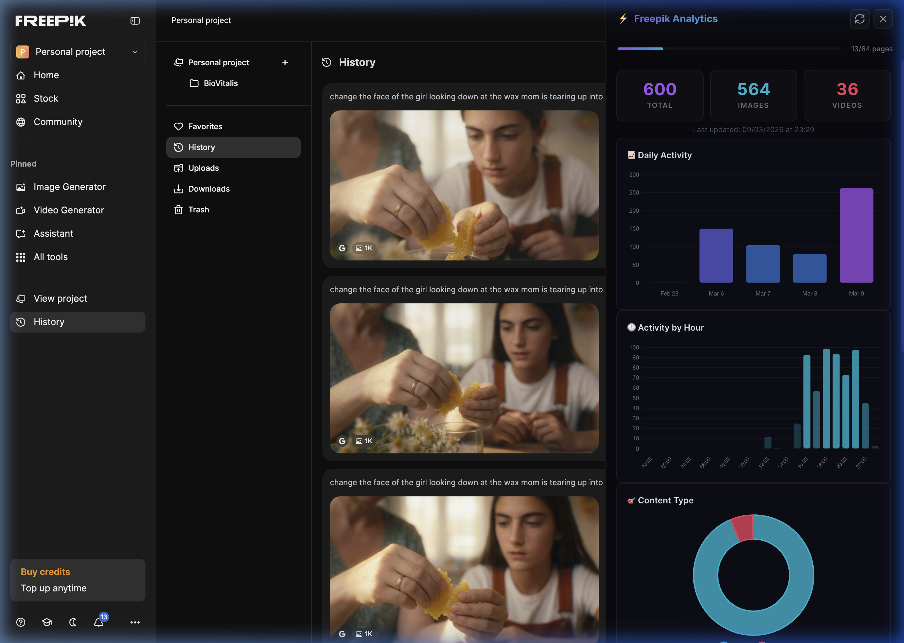
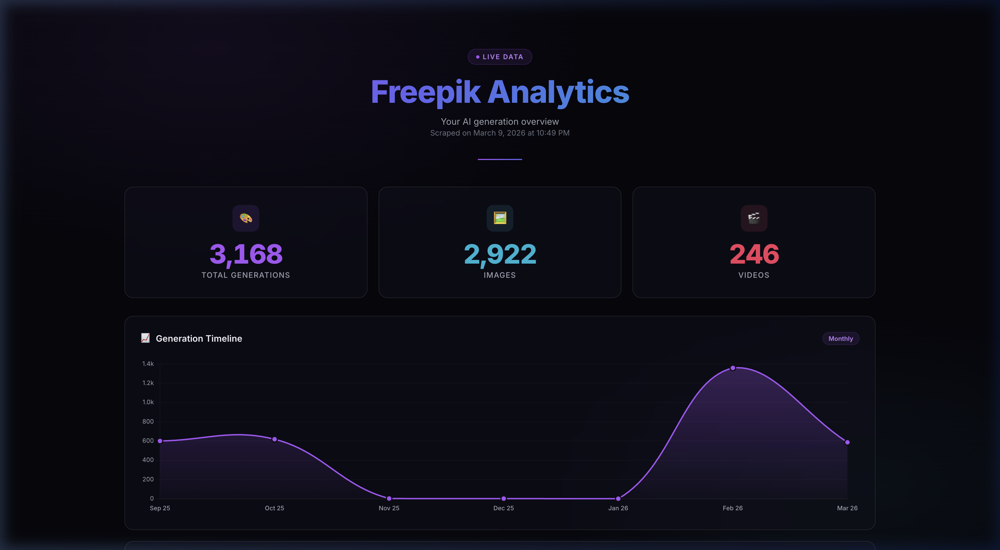
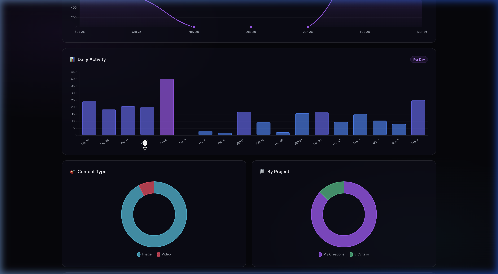
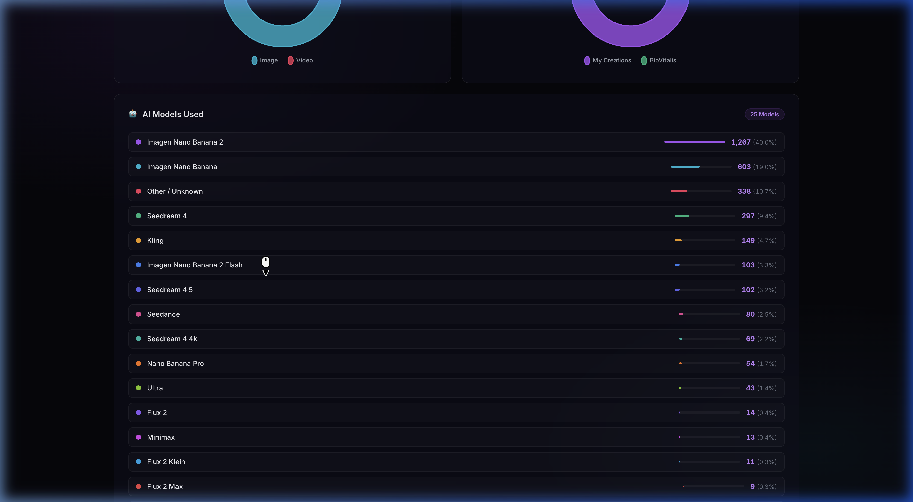

<div align="center">

# ⚡ Freepik Analytics

**Track your AI generation stats directly on Freepik**

A Chrome Extension that intercepts the Freepik API and injects a real-time analytics dashboard — right into the website. See your total generations, daily/hourly activity, AI models used, and more.

[](https://github.com/timon2200/freepik-analytics)
[](https://developer.chrome.com/docs/extensions/mv3/intro/)
[](LICENSE)

</div>

---

<div align="center">



*The analytics panel slides in from the right while you browse Freepik*

</div>

---

## ✨ Features

- **🔌 API Interception** — Fetches data directly from Freepik's internal API using your session cookies. No scraping, no DOM parsing — just clean API calls.
- **📊 Real-time Progressive Loading** — Dashboard updates live as pages are fetched. Watch your numbers climb in real-time with smooth counter animations.
- **📈 Day-by-Day Timeline** — Bar chart showing your generation activity over time.
- **🕐 Hour-by-Hour Breakdown** — See when you're most active during the day.
- **🤖 AI Model Tracking** — Full breakdown of every AI model you've used with percentages and progress bars.
- **🏢 Provider Analytics** — See which AI providers power your generations (Google, ByteDance, Kling, etc.)
- **🛠️ Tool Usage** — Track text-to-image, video generation, uploads, and more.
- **📁 Project Breakdown** — See generation counts per project.
- **💾 Smart Caching** — Data cached in `chrome.storage.local` with 1-hour TTL. No re-fetching on every page visit.
- **👤 Per-Profile Isolation** — Different Chrome profiles = different Freepik accounts = separate data. Works for multiple accounts.
- **🌙 Dark Theme** — Premium glassmorphism design that matches Freepik's dark UI.

## 🚀 Installation

### From Source (Developer Mode)

1. **Clone the repo**
   ```bash
   git clone https://github.com/timon2200/freepik-analytics.git
   ```

2. **Open Chrome Extensions**
   ```
   Navigate to chrome://extensions
   ```

3. **Enable Developer Mode** — Toggle in the top-right corner

4. **Load Unpacked** — Click "Load unpacked" and select the cloned folder

5. **Navigate to Freepik** — Go to any [freepik.com](https://www.freepik.com) page while logged in

6. **Click the purple toggle** on the right edge of the screen ⚡

## 📸 Screenshots

<details>
<summary><b>📊 Full Dashboard View</b> (click to expand)</summary>

<br>

| Hero Stats & Daily Activity | Hourly Breakdown & Content Type |
|---|---|
|  |  |

| AI Models Breakdown |
|---|
|  |

</details>

## 🏗️ How It Works

```
┌─────────────────────────────────────────────────┐
│                Chrome Extension                  │
├─────────────────────────────────────────────────┤
│                                                  │
│  Content Script (content.js)                     │
│  ├── Runs on *.freepik.com/*                     │
│  ├── Fetches /pikaso/api/projects/files/recent   │
│  ├── Paginates through ALL pages (50/page)       │
│  ├── Aggregates: type, model, provider, hourly   │
│  ├── Caches in chrome.storage.local              │
│  └── Injects dashboard via Shadow DOM            │
│                                                  │
│  Dashboard (Shadow DOM)                          │
│  ├── Isolated CSS (no conflicts with Freepik)    │
│  ├── Chart.js for visualizations                 │
│  ├── Smooth counter animations                   │
│  └── Progressive rendering during fetch          │
│                                                  │
│  Popup (popup.html)                              │
│  └── Quick stats from cached data                │
│                                                  │
└─────────────────────────────────────────────────┘
```

**Key technical decisions:**

- **Shadow DOM** keeps the dashboard CSS completely isolated from Freepik's styles
- **Bundled Chart.js** — Loaded locally to bypass Content Security Policy restrictions
- **Progressive rendering** — Dashboard renders after the first API page and updates every 3 pages
- **Rate limit handling** — Auto-retries with backoff on 429 responses
- **`chrome.storage.local`** is per Chrome profile, so different logged-in accounts are automatically isolated

## 📁 Project Structure

```
freepik-analytics/
├── manifest.json        # Extension manifest (Manifest V3)
├── content.js           # Content script — API fetcher + dashboard injector
├── dashboard.css        # Dashboard styles (injected into Shadow DOM)
├── popup.html           # Extension popup — quick stats
├── popup.css            # Popup styles
├── popup.js             # Popup logic
├── lib/
│   └── chart.min.js     # Bundled Chart.js v4.4.7
├── icons/
│   ├── icon16.png
│   ├── icon48.png
│   └── icon128.png
└── screenshots/
    └── ...
```

## 🔒 Privacy

- **No external servers** — All data stays in your browser's local storage
- **No tracking** — Zero analytics, telemetry, or data collection
- **No auth tokens** — Uses existing Freepik session cookies (already in your browser)
- **Open source** — Full code is right here for you to audit

## 🤝 Contributing

Pull requests are welcome! Feel free to open issues for bugs or feature requests.

## 📄 License

MIT — do whatever you want with it.

---

<div align="center">

**Made with ⚡ for Freepik power users**

</div>
